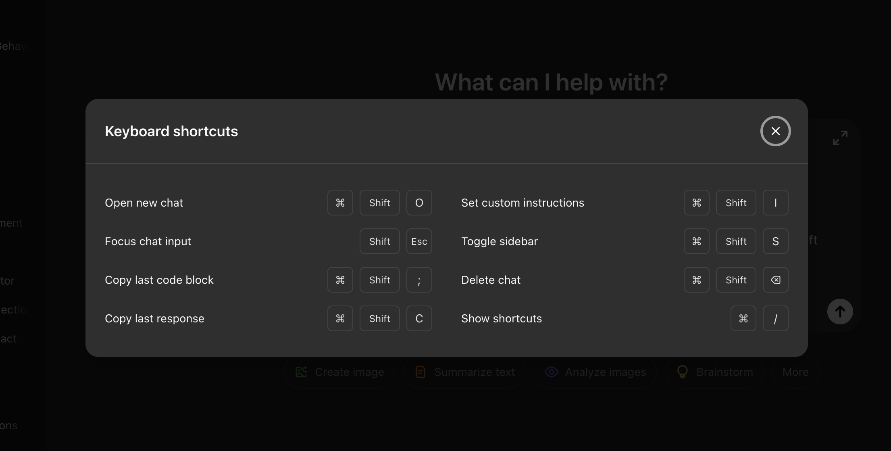
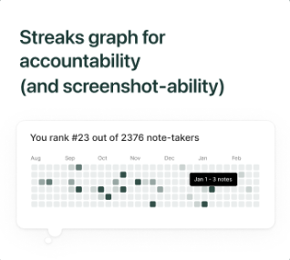
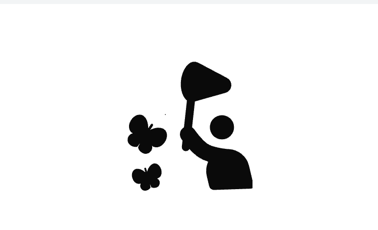
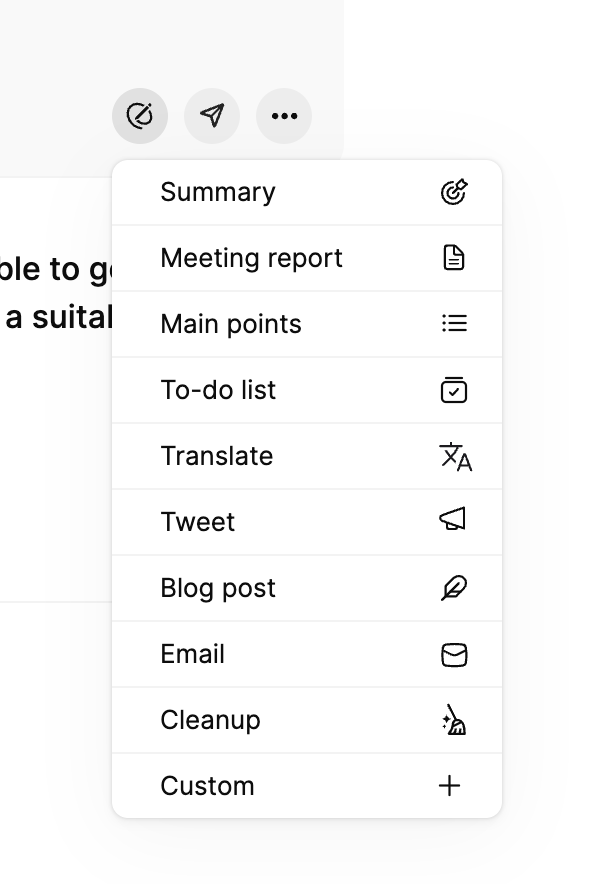
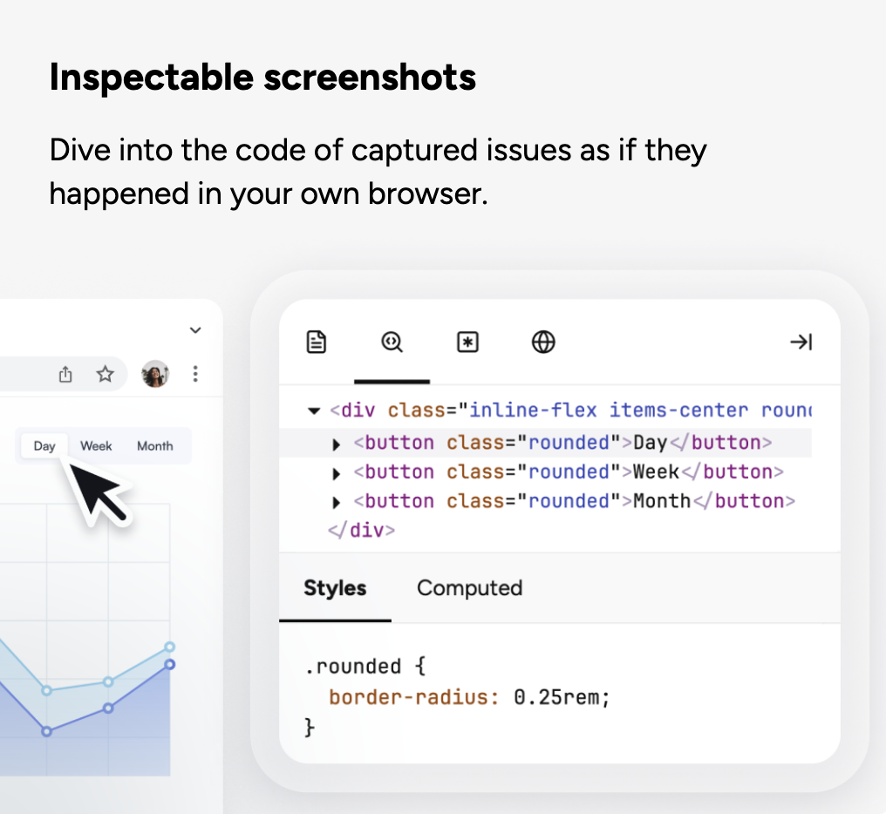

# App: Ideas & Bugs  
  
Ideas:  
- [ ] Configurations:  
    - [ ] Allow to configure the time of records:  
        - [ ] Context: up to 2 mins?  
        - [ ] Instant play: 30 sec to 2mins?  
        - [ ] Video: infinite  
    - [ ]   
- [ ] Send some sort of tokens how openai did for spending tokens or yt https://x.com/xanderatallah/status/1975418042713874920  
- [ ] [171] EXT: Implement keyboard shortcuts  
    - [ ] Improve shortcuts display,   
        - [ ] Display mode if linux/windows and macOS (cmd or ctrl icon)  
        - [ ] Add missing shortcuts everywhere where is needed (tooltips. Etc)   
        - [ ] Add ESC to set to defaultElement?  
        - [ ] https://developer.chrome.com/docs/extensions/reference/api/commands  
-   
  
- [ ] QA tests the Acs, agent tests next time once dev is done  
- [x] EXT or BE: Add config package?  
    - Create a shared package that will contain, global configs, settings, enums for actions etc?  
- Research: Replace logs with data dog? Or reporting logs service  
- [x] EXT: Improve REDACTED BY BRIE for network headers and response  
- [70] EXT: Add a blur tool to the annotation.  
- [172] EXT: Safari support:   
    - [https://evilmartians.com/chronicles/how-to-quickly-and-weightlessly-convert-chrome-extensions-to-safari](https://evilmartians.com/chronicles/how-to-quickly-and-weightlessly-convert-chrome-extensions-to-safari)  
    - [https://bartsolutions.medium.com/how-to-convert-an-chrome-extension-into-a-safari-web-extension-and-upload-to-mac-app-store-69c0f7142178](https://bartsolutions.medium.com/how-to-convert-an-chrome-extension-into-a-safari-web-extension-and-upload-to-mac-app-store-69c0f7142178)  
- [rejected?] EXT: Add loading message when a screen is taken too long to be displayed?  
- EXT, FE, BE: Add jsdoc documentation  
- [x] [173] EXT: contextMenus - add capture screenshot, when you click right on a page to activate capture screenshot or to have a dropdown with options  
- EXT: Offline mode?  
    - Save internal the issues, once online save them?  
- [x] EXT, FE, BE: No account required (no signup required)?  
    - Save and share a temporary link issue which will expire in 7 days.  
    - Set a daily limit of 10 created bugs?  
    - Display list of temporary links?  
    - Restrict some data which is shared, show list of requests , device info, and console OR show generalized as on [marker.io](http://marker.io)?  
  
- Limit the requests to be made just from extension?  
- EXT & FE: FUTURE: Send to BE: Capture full screenshot, send position and size details of cropped section? Is performance worth?  
    - Also this will allow us to edit afterwards the annotations  
- EXT & FE:  FUTURE: capture annotations shapes objects, to enable edit annotations?  
- Optimization/ Performance / Code split etc / [https://million.dev/](https://million.dev/) / react-scan / babel-plugin-react-compiler for vite  
- EXT: Pagination implementation for Slices History section with default 5 and make the top sticky?  
- FE, BE: Activity graph like GitHub??  
    - Reported bugs  
  
- FE-BE: Add restrict or hasFeature hook to manage what user sees  
- FE, BE: Mark private - public slices feature (account required)  
- SDK: Javascript SDK - Take control of the widget via JavaScript SDK and pass custom metadata about your users or technical environment.  
- SDK: OR install it and automatically capture issues when client have them (collect event and requests before issue appear and create an issue automatically)  
- BE: secure records.json file?  
- FE, BE: Ability to tag a work item/story - QA team will be safe to demonstrate that they tested the thicket.  
- EXT, FE: Add missing statistics under the table of networks requests -> see chrome network tab (total requests etc)  
- [x]  EXT: Implement multiple env support for better dev ex  
- WEB: Create download page which contains other browsers: [https://adblockplus.org/en/download](https://adblockplus.org/en/download)  
- EXT: Best practices: [https://support.google.com/chrome_webstore/answer/1050673?hl=en&visit_id=638746631200995270-4161943801&p=cws_badges&rd=1#cws_badges&zippy=%2Cunderstand-chrome-web-store-badges](https://support.google.com/chrome_webstore/answer/1050673?hl=en&visit_id=638746631200995270-4161943801&p=cws_badges&rd=1#cws_badges&zippy=%2Cunderstand-chrome-web-store-badges)  
- EXT or FE: Include or exclude details report, leave just the screenshots  
- EXT: Full page screenshot using external api, such as: screenshotone (sponsored?)  
- REPO: Add greptile to review and enhance the PRs? (sponsored?)  
- APP: Rewards? [https://x.com/the_sam_uel/status/1900493663467130923/photo/1](https://x.com/the_sam_uel/status/1900493663467130923/photo/1)  
- Create an animation how a person squashes bugs:   
  
- Export or Upload HAR file  
    - To do research maybe is possible to work this way instead of collecting the requests and so on?  
- Support other platforms and OS:  
    - Mac,   
    - Windows,   
    - iOS and Android app that records everything  
-   
  
Bugs Backlog:  
  
Phase 0.3.2:  
- [x] Rebuild the ext, and click area, nothing happens, refresh the page ext works  
    - [x] EXT: First usage after you install  
        - Error message when trying to create the slice  
        - On second try to click, does not add all events  
        - Inspect all posible scenarios  
- [ ] [#156, deugged, bug created] web sites the style is weird  
    - [ ] Yc (only on it I see the issue)  
    - [ ] Linkedin   
- [x] Storage improvements  
- [x] Headers   
- [x] Brakes the app:  
    - [x] and medsol,   
    - [x] V0 v0 (generation does not work)  
    - [x] LinkedIn (not able to write a post)  
    - [x]  state farm pay  
- [x] Console log errors caused by ext  
    - [x] And others  
    - [x] Dataclone   
  
Phase 0.4.0:  
- [x] Run plan seeds on PROD  
- [x] EXT: Capture description, right side bar  
- [x] EXT: Install or/and update, the other pages are not displaying the refresh message  
    - Only the current one  
- [ ] [#164] User action/events are captured in extension context  
- [x] [195] EXT, BE, FE: Register an account (with no public slides), options available:  
    - [ ] EXT: Guests vs Accounts user have different features available  
            - [ ] Create a hook? Related to permissions?  
            - [ ] Put together an spreadsheet with available feature  
            - [ ] No restrictions for Account  
- [x] [#165] Remove the stored records by tabId or url?  
  
    - [x] EXT: If Account, use account related endpoints and vice versa as Guest  
            - [x] Endpoints  
            - [x] Slices history  
        - [x] FE & BE: Register flow (FREE only)  
            - [x] Update/check stripe  
                - [x] Prices  
                - [x] Improve subscription flow, since we have a free plan, now  
                - [x] Secrets  
            - [x] Webhook setup for sandbox  
            - [x] Auto login after reg or login  
            - [x] Free plan by default  
        - [x] EXT, FE & BE: Check refresh token flow if works as expected  
        - [x] EXT: Once successfully created or logged in  
            - Store access token and use it to land to capture view  
                - If no, land back to login screen  
        - [x] FE & BE: Login flow  
        - [x] EXT: On install see first screen:  Login/Signup Account and Guest   
            - Account: open the signup page using recommended action link, check chrome and others  
            - guest: open existing view  
- [x] [fixed] Scroll on the page and take the screenshot, the screenshot isn’t what user selected,   
    - [x] Yc  
    - [x] at least on GitHub,   
- [x] [fixed?] yellow background remain when screen is taken  
  
v0.5.0+  
Low Priority  
- [ ] EXT: Redesign use cases views from popup (refresh, internal page, etc guards)  
- [ ] EXT: Microphone  
    - [ ] - add hot to enable permission guide   
    - [ ] - add how to remove the extension from blocked   
    - [ ] Add microphone toggle component in popup and toolbar   
- [ ] Linear agent  
    - [ ] Assign to a ticket and investigate and fix the bug, use existing context if any  
- [ ] APP: Login last method used badge: “Last used”  
- [ ] EXT: The share link is automatically copied to your clipboard, so you can paste it directly into Slack, Jira, Linear, or email.  
- [ ] EXT: bug when token expires the ext will ask to login after you’ll be redirected to the app, since the app has the waiting toest promise the redirect will happen back to the extension as a login event, but actual token is expired   
- [ ] BE: Add notifications service which will share  
    - [ ] A new created account  
    - [ ] Login with demo email  
    - [ ] New Payment  
- [ ] EXT: Add feature back:  
    - [ ] Enable back continue as a guest  
    - [ ] Generate AI droptodwn   
        - [ ] Add OPENAI ends to prod and sandbox  
- [ ] Price page: https://reshaped.so/pricing  
- [ ] Iprove accessivbilty  
- [ ] Improve speed  
    - [ ] Mostly content-ui  
- [ ] Add maximize and minimize to description OR to sidebars?  
- [ ] Add folder: add search to search by name since by default is 10 records only  
- [ ] Export image: output resolution is disabled  
- [ ] Refractor to user rrweb to capture  
    - [ ] Logs  
    - [ ] User actions  
    - [ ] Etc  
- [ ] Typefull example of confirm action once a destructive ban is clicked  
- [ ] Popup: (wait for users feedback)  
    - [ ] add a toggle to choose the mode 'single' | 'multiple  
- [ ] Left sidebar: (they can currently to use minimize)  
    - [ ] If no screenshots, add ability to add a screenshot??  
- [ ] Zoom up to -20 to +100 in annotation view  
- [ ] Add crop image tool  
- [ ] Once you select a tool, change the cursor to display the custom cursor based on your selection   
- [ ] Change the text size if you use drag and drop shape using the controls  
- [ ] Simulate macOS edit screenshot behavior when working with shapes  
        - [ ] Do not reset the shape to hand, leave it as it is??  
- [ ] On mobile:   
        - [ ] Sidebars -> menu from bottom??  
        - [ ] On small screen, open left sidebar -> closes right one and vice versa  
            - [ ] If only one screen - close by default  
- [ ] Dark mode content ui  
- [ ] Select Area, open extension popup and select one of capture option. Better to disable.  
- [ ] Breaks:  
    - [ ]  the edge overview  
    - [ ] Go daddy login  
    - [ ] Chatgpt - breaks the animations (when is thinking)  
- [ ] Make the preview mode more relishing (dubco news)  
- [ ] Full screen capture does not work on some websites: chatgpt  
- [ ] When take as screen sometimes is taking too long, use skeleton to display it first and after display image on preview mode  
- [ ] Develop a dedicated mobile version of content ui  
- [ ] Refactor to have a moder web app architecture  
- [ ] Web transitions (animations, etc)  
- [ ] Daily tips: as we see on GitHub, could be located in footer right  
- [ ] APP: Refactor report view using new design  
- [ ] BE: setup two mail servers and services: [https://chatgpt.com/c/68ee6d12-9098-832f-aed8-ce70463e161a](https://chatgpt.com/c/68ee6d12-9098-832f-aed8-ce70463e161a)  
- [ ] Posthog’s onboarding experience, which allows to configure if to capture logs, networks and other  
    - [ ] https://linear.app/brie/welcome  
- [ ] APP & BE: no access to unauthorized workspaces/slices  
- [ ] EXT: REDACTED_BY_BRIE/2025 when working with calendar dates inputs  
- [ ] EXT & APP: Use  placeholder if no label is present  
- [ ] Remove left and back to open tab, add it under settings  
    - [ ] Or: emit browser went offline/online or/and display 44s of inactivity   
- [ ] EXT: Events - Duplicated calendar, toggle and checkbox inputs   
    - [ ] Test first on direfrent sites  
- [ ] APP & EXT: Let’s say user click logout in the app what’s next whiten the extension? Is he delogged?  
    - [ ] Same when refresh token expires  
- [ ] BE: migrate to resend???  
    - [ ] Just for direct communication such: welcome email???  
- [ ] EXT: Integrate rrweb and populate the rrweb body payload  
        - [ ] Does not collect the user’s actions  
- [ ] Server: Update PM2 to latest version  
- [ ] EXT: Add tests:  
    - [ ] Auth  
    - [ ] Repro Steps  
    - [ ] Edit sensitive info  
- [ ] If not implementing Guest, then we’ll need to remove the logic related to slice and deleted at  
- [ ] APP & BE: Implement Public slices, share them with:  
    - [ ] Email  
    - [ ] People from team  
    - [ ] note: see Google Drive  
    - [x] Anyone with the link  
- [ ] EXT: Migrate to debugger API which is alternative of CDP Chrome DevTools Protocol in MV3: [https://developer.chrome.com/docs/extensions/reference/api/debugger](https://developer.chrome.com/docs/extensions/reference/api/debugger)  
    - [ ] **DOMSnapshot.captureSnapshot**  
    - [ ] Cookies, logs, networks etc  
    - [ ] Note: supoported by the chrome only: https://chatgpt.com/c/68fe3e66-fe1c-832d-a2ac-ea699d89ec29  
- [ ] EXT: Network API: [https://developer.chrome.com/docs/extensions/reference/api/devtools/network](https://developer.chrome.com/docs/extensions/reference/api/devtools/network)  
    - [ ] Allows to download the HAR   
    - [ ] note: is Only when dev tool is open  
- [ ] Adapt the redesign for GUEST accounts  
    - [ ] Create a guard component with pop up or tool tip to say that you can use this feature if FREE or PRO user, see dubco  
    - [ ] Restrict/protect the backend  
- [ ] EXT: take screenshot -> edit -> add attachments or description or labels -> minimize -> edit => no data present, all was cleaned  
- [ ] EXT: the popup after login is not updating? The auth page stays   
- [ ] EXT: When selecting Drag and drop an reopen the popup it not restricting the user to reselect, it should  
- [ ] EXT: When only click on drag and drop does not take the full screen image  
- [ ] EXT: collect errors  
- [ ] BE, FE & EXT: Look into the error status code, right now we get ins some places 200 OK even if it should be other  
- [ ] APP: Use slice state prop to display it and if any error  
    - [ ] If uploading an attachment fails, add status or something to understand why  
- [ ] EXT: when upload an attachement add size validation  
- [ ] EXT & APP: If a field is already filled with a value, if you edit it will say Typed in actions, will be worth looking to say in this case Edited, same for others”?  
- [ ] BE: if no bugs created for X days send a email if help needed  
- [ ] BE & FE & EXT: Audit logs: View all actions taken in your team workspace by all team members.  
- [ ] BE & APP: Integrations:   
    - [ ] Two ways sync:   
        - [ ] Update issue- do we need it, since will be refined?  
        - [ ] update on Linear  
- [x] EXT: notify that there is a bug happened and if click “report”: will open the annotation modal with the last 30sec replay  
- [x] APP: add workspace selection dropdown  
    - [ ] Update the setup integration logic on setup.page  
  
- [ ] Allow user to intercept and edit a request (requestly??)  
        - [ ] Like basically to edit the payload or status or anything to text some use cases  
- [x] Session expired on APP, log on EXT -> 401  
- [x] EXT: When open the popup you see the login screen for a sec  
        - [x] - create a separate loading screen or something until the data will be populated   
  
High Priority  
v5.1.2  
- [x] EXT: on Firefox, no metadata, console, network etc details (check if the issue is on PROD)  
- [x] I should not be able to access this: [https://app.briehq.com/slices/cmgxm4w41000rfword16rgeyi](https://app.briehq.com/slices/cmgxm4w41000rfword16rgeyi) only if is public  
- [x] App: Edit slice does not work  
- [x] APP: On verification step, the component sometimes isn’t working properly, see recordings in post hog: [https://us.posthog.com/project/235755/replay/home?sessionRecordingId=019a0d9e-a7be-733e-84ff-aca3e3cccf83](https://us.posthog.com/project/235755/replay/home?sessionRecordingId=019a0d9e-a7be-733e-84ff-aca3e3cccf83)  
    - [x] Note: refactored, we’ll monitor  
- [x] APP: Opened link to [/admin/job-requests](https://shifts.dev.ciro.medsoltech.io/admin/job-requests) by clicking <a /> labeled "Primary"  
- [x] EXT: events:  
    - [x] Typed "Password123!" in <input id="okta-signin-password" type="password" /> labeled "Password"   
    - [x] Typed "REDACTED_BY_BRIE/2025" in <input id="start-date" type="text" /> labeled "start-date"  
    - [x] Typed "REDACTED_BY_BRIE" in <input id="idp-discovery-username" type="text" /> labeled "Username"  
- [x] APP: Clicked button <input id="idp-discovery-submit" type="submit" /> labeled "idp-discovery-submit"  
- [x] EXT: what’s happening when you are logged as guest? How to log out? Or login?  
    - [x] Force to display the log in screen that we currently have if authmethod = guest  
- [x] EXT: in Firefox the login method does not work, probably is not supported by Firefox.  
- [x] Repro steps are not correct and on some websites they are not collected, look into adopting rrweb package for capturing??  
    - [x] EXT: After storing as json, we’ll need to refactor the app view to use the correct ones  
- [x] Ext: remove [api.briehq.com](http://api.briehq.com) requests form the network and content  
- [x] APP: after code verification check if redirect works properly   
    - [x] Check if i restricted to access only ur created slice  
    - [x] Check logs  
    - [x] Add session reply  
- [x] BE: Update email title since is using Picky instead of Brie  
- [x] BE: improve the email deliverability  
    - [x] Use mail tester  
- [x] Contact go daddy the personal email does not work  
  
v0.5.27  
- [x] EXT: issue when using annotation in console tab of browser  
    - [x] Works if 2 screenshopsts  
    - [x] Could be the issue with adding annotation on first screen -> switch to second, - back to first etc  
- [x] EXT: check if rewrites the network requests: use assignments -> change status -> change status => you should have 2 endpoints call but with 2 different payload and data  
    - [x] APP: Styles for the code to update  
    - [x] Check requests Request tab in APP and see why [object Object] is displayed: http://localhost:5173/slices/f83454e1-a1d7-4c99-b35c-65d4e7af6ee7  
    - [x] Make 1 request after another one but the same, are they getting rewritten? Use uniques ids (xhr, fetch and background )  
- [x] EXT: Fetch and XHR requests are created as separated requests, when they should be merged with the webRequests ones  
    - [x] Hash table per tabId  
- [x] EXT: open example site -> refresh the EXT => login => take screenshot -> no drag and drop (NO REFRESH SCREeN)  
- [x] EXT: Get records from 2 min by default?? Or store last requests happened in last 2min  
    - [x] auto-trim large record bundles using time windows around screenshots and failed network events  
    - [x] If the records file is too large return a time framed list  
    - [x] Set file size restriction  
- [x] EXT: improve background scripts with an entry point and to use polypill?  
    - [x] See if we can refactor the auth hook?  
    - [x] Migrate old get redirect logic for unsupported scenario when login?  
- [x] EXT: when refresh, clean up the popup storage related stores  
- [x] EXT: Do not let the user create slices or take screenshots if tokens expired  
    - [x] The session could be expired but we still see the take screenshots view  
    - [x] To call /helth more often?  
    - [x] NOTE: I think this is fixed by checking the user details  
- [x] EXT: Refresh after injection of the extension view - doesn’t appear  
- [x] EXT: Preview: Save as - Image name is a long string, the image it’seft  
- [x] EXT: after login successfully or failed display a toast message that is ready to go  
- [x] APP: Public slice view page is broken due to contract  
- [x] EXT: Reset stored records if closed the tab or refreshed  
- [x] EXT:  on Firefox, the workspace dropdown is empty initially, click minimize and again edit to populate (due to redux provider being conditionally rendered??)  
  
v0.5.35  
- [ ] Close popup after login succes (no)  
- [ ]   
- [ ] EXT, FE, BE: Integrations:   
    - [x] Linear  
        - [ ] When choose the Linea-> see linear available fields? Or currently map the existing  
        - [ ] build the **update external issue** endpoint for status sync  
        - [ ] handle optimistic concurrency / synchronization  
        - [ ] Decide what *subset* of fields you truly want to sync (status only? status + assignee?).  
        - [x] Implement the Linear-specific mapping for status/priority in LinearAdapter using  
        - [x] build the field mapping engine  
        - [x] stub a real LinearAdapter.createIssue  
        - [x] define integration connection creation flow  
        - [x] define consistent FE data models  
        - [x] Display is a linear issue  
        - [x] You can create a integration issue ticket of an existing bug  
- [x] (L) EXT: Redact sensitive data in events  
- [x] (L) EXT: Use context menu to take screenshots, will allow even if ur deauthenticated  
- [x] (L) EXT: ENUM PR by luminita   
- [x] (L) EXT: Translate missing strings  
- [x] EXT: Extract isInternalPage and pendingReloadTabs into a separated components guards?  
    - [x] Test it??  
- [x] Add the bug notification and   
- [x] copy for AI button feature  
- [x] Improve lp copy to make it clear  
- [x] LP: Landing page: [https://prodextension.com](https://prodextension.com)  
  
v0.6.35  
- [ ] Tailwind sponsorship  
    - [x] Publish  
    - [x] Add paid plans  
    - [x] Logo - use canvas  
    - [x] Dubco link  
    - [x] Update Register page - Use shadcn  
    - [x] Complete share video  
- [ ] [174] EXT, FE, BE: Session replay  
    - [ ] (priority) NPM or script  
        - [ ] Create a slice automatically If issue 400 and up status or error log  
    - [x] EXT: User Session replay [https://www.statsig.com/session-replay](https://www.statsig.com/session-replay) (later)  
    - [x] Trim  
        - [ ] *if no login - no recording (dropping)*  
        - [ ]   
        - [x] *add a copy or something to let user that is recording?? or the togel is enoght*  
        - [x] Bug: if you drag the start trim handle the events are played from the start not from the trim  
- [ ] Alert about issue  
    - [ ] (priority) Email  
    - [ ] Slack  
- [x] (priority) BE & FE: Generate a fix (should be already provided the suggestions)  
    - [ ] Implement OAuth, will allow to create PR from beffah of the user  
        - [ ] Request user authorization (OAuth) during installation  
    - [x] Improve PR body, add steps etc  
    - [x] Approve or reject the suggestions (use GitHub as diff design)  
    - [x] Connect a repo  
- [x] (priority) EXT: Video recording  
    - [ ] (Later) History: redo, undo, reset  
    - [ ] EXT: Bugs:  
        - [ ] When mp4 selected to download and try to open it gives an error  
        - [ ] If no trim, video does not have the duration  
        - [ ] Mp4 fails to be exported  
        - [x] marker shapes remain if the video is stoped  
        - [x] video player resize to improve (as we did for screenshots)  
    - [x] *display overlay and toolbar only in the active tab*  
    - [x] Events: add start and end recording events and add the segments and video metadata  
        - [x] Delete records at on create   
        - [x] Emit meta as well  
    - [x] APP: Display video in app  
    - [x] APP, EXT, BE: Pass and store video on BE  
- [x] (priority) Popup redesign 2.0   
    - [x] Set active tab and mode and state  
  
v0.635+  
- [ ] Add auth methods:  
    - [ ] Gmail  
    - [ ] X  
    - [x] Phone   
- [x] Add onboarding (eleven labs ex)  
    - [x] Let them know to install the extension  
    - [x] Paywall  
    - [x] Etc  
    - [x] Ask name  
- [x] No more workspaces.page.tsx page  
- [x] Implement on way to login and register   
    - [x] using /auth page name??  
- [x] Migrate to next’s  
  
v0.6.xx - priority,== **goal: increase customers**==  
- [ ] Security:  
    - [ ] EXT  
    - [x] FE  
    - [x] BE  
- [ ] Slice details page redesign  
- [ ] Add oath:  
    - [ ] GitHub (nice to have)  
    - [ ] Google   
    - [ ] Phone  
- [ ] Auth  
    - [ ] E2e tests  
    - [ ] Unit tests  
    - [ ] Integration tests  
- [ ] Plans + subscr  
    - [ ] E2e tests  
    - [ ] Unit tests  
    - [ ] Integration tests  
- [ ] Apollo:   
    - [ ] Campagne: ask for feedback give live time free, use big tech names  
    - [ ] Connect multiple emails  
- [ ] Extension assets  
    - [ ] Logo  
    - [ ] Screenshots  
    - [ ] Video, use x bookmarks (hook etc)  
- [ ] Backlinks  
- [ ] Reddit   
- [ ] Docs   
    - [ ] Use to make videos   
- [ ] EXT: On update/install use the public metrics to build the landing for call to action and pay as on ads blocker ext  
- [x] Add a total bug tickets created on landing page  
    - [x] Expose an API endpoint  
- [x] Slice asset refactor to test  
  
v0.6.35+  
- [ ] BE & FE: MCP  
    - [ ] Can we use the slice public page as content to feed the ai?  
- [ ] APP: Recording links: send a link record everting (no need to install something):   
    - [ ] [https://mail.google.com/mail/u/0/#inbox/FMfcgzQbffVZnRGZCZrFBLrjxtMNZdNz](https://mail.google.com/mail/u/0/#inbox/FMfcgzQbffVZnRGZCZrFBLrjxtMNZdNz)  
    - [ ] [https://www.youtube.com/watch?v=GP0SBqWU-58&ab_channel=Jam](https://www.youtube.com/watch?v=GP0SBqWU-58&ab_channel=Jam)  
    - [ ] Implementation how we want: [https://chatgpt.com/share/684090f3-9a90-8009-ac93-ba675369cc52](https://chatgpt.com/share/684090f3-9a90-8009-ac93-ba675369cc52)  
- [x] APP: Copy page feature: https://www.mintlify.com/docs/components  
  
v0.5.30+  
- [ ] EXT, FE, BE: Integrations:   
    - [ ] Jira,   
    - [ ] Azure,   
- [ ] APP, BE: Create from repro steps -> test cases   
    - [ ] Assign ticket to take care of AC  
    - [ ] Allow to add and annotate screenshots  
    - [ ] Export or integration with:  
        - [ ] linear  
        - [ ]  jira,   
        - [ ] azdo,   
- [ ] LP: Add Help and Blog (use [dub.co](http://dub.co) repo for inso) and Docs (mintlify repo)  
- [ ] EXT & BE: Assets:  
    - [ ] Restrict 10 shots and attachments by default  
    - [ ] Restrict formats on both sides  
    - [ ] Restict size  
    - [ ] Security	Validate MIME/size server‑side, scan attachments asynchronously if you need AV  
    - [ ] Cleanup DB & Storage for canceled or draft slices, cron once 24/h  
- [x] If you drag and drop under the preview image then it still appears in images, could be timing issue  
- [x] APP: shadcn layout sidebar  
- [x] Sometimes is letting you to take shots, but after /refresh is logging off but the content ui is open (health api retry more often?)  
  
- [x] Create a ticket to upholster to remove their ip from spamhaus blacklist  
- [x] Founders video  
- [x] Demo video  
- [x] BE: AI endpoint:  
    - [x] Generate full bug report  
    - [x] Generate steps to reproduce  
- [x] APP: Refactor slices view to be cards by default  
- [x] APP: Refactor report view to match new slice contract  
- [x] BE: separate create slice endpoint  
- [x] implements the idempotent “init or reuse”  
- [x] BE: remove sensitive properties, eg: /me the passwords is there  
- [x] Annotation view  
    - [x] Mobile version responsiveness   
    - [x] Backspace/ del / z, x, c, etc buttons does not delete the shape  
- [x] Draw with hightliter and after change the color, it sets without the transparency  
- [x] Notify the user after taking first screenshot that he can continue taking screenshots or edit (sooner + action?)  
- [x] When Drag and drop mode   
    - [x] If no drag, but only Click, does not take the screenshot  
    - [x] Disable the capture options  
    - [x] - hide the preview minimize div from image  
- [x] Don’t let to take a screenshot when the modal is open  
- [x] Controls are inside the shape margin boundary on initial render  
- [x] Capture screen, close modal, capture again, open modal -> no screenshot displayed  
- [x] Take 2 shots, modify the first one, got to first, go back to first, open / close side bar - is been cropped  
- [x] Save the original size of the image for export purposes: setCanvasBackground and export ing  
  
    - [x] Annotation Delete button position is not aligned with the shape  
    - [x] Resize the canvas, the shapes should resize as well and keep the position  
    - [x] Try to move shapes, they are centered to different coordinates  
    - [x] Color: make it to be a circle with the red color by default, on click the pallet will appear with predefined colors (popover)  
    - [x] Hide minimized preview div in screenshots  
- [ ] Issues during testing:  
    - [ ] Dot and text alignment mobile: [https://x.com/messages/263301419-1225068918026358784](https://x.com/messages/263301419-1225068918026358784)  
    - [ ] Improve annotations: [https://x.com/messages/263301419-1661047153920471040](https://x.com/messages/263301419-1661047153920471040)  
    - [x] [Guest?] Not able to create slice:  
        - [x] [https://x.com/messages/263301419-916250931980914688](https://x.com/messages/263301419-916250931980914688)  
        - [x] [https://x.com/messages/263301419-963052455624880128](https://x.com/messages/263301419-963052455624880128)  
        - [x] [https://x.com/messages/263301419-1661047153920471040](https://x.com/messages/263301419-1661047153920471040)  
        - [x]  [https://x.com/messages/263301419-1257892177960677376](https://x.com/messages/263301419-1257892177960677376)  
- [ ] Create a safe sendMessage and refactor  
- [x] Content UI Redesign  
- [x] Download image button  
  
  
  
0.x.x  
- [ ] FE, BE: Create from generated report -> defect, bug, story or feature, epic?  
-   
- [ ] FE & EXT: Inspectable screenshots  
-   
  
Phase 1.2:  
- [ ] BE: Remove after 7 days for no accounts  
    - [ ] BE: Delete guests slices after 7 days  
- [ ] Crop tool for screenshots  
- [ ] Voice integration   
    - [ ] Voice notes  
    - [ ] Transcription  
    - [ ] Run command  
- [ ] Ticket integration to check the AC while you test  
  
Phase 2.0:  
- [x] Redesign  
- [x] [33] EXT: Shadcn ui not working properly   
- [x] EXT: sometimes QAs are doing more than one screenshot with annotations , take as screenshot and display it to bottom right (see screen studio design) and take another OR to add + icon to the annotation canvas as it is on use picky (can be a toggle that will say do multiple screenshots)  
  
  
  
0.x.x  
- [ ] EXT, BE, FE: Welcome letter after installing the extension  
    - [https://www.betterbugs.io/welcome-page](https://www.betterbugs.io/welcome-page)  
    - https://prodextension.com/welcome  
    - [https://mail.google.com/mail/u/0/#inbox/FMfcgzQbfBsdJhZQBBWCDPGTrHCHDWXw](https://mail.google.com/mail/u/0/#inbox/FMfcgzQbfBsdJhZQBBWCDPGTrHCHDWXw)  
- EXT & FE: Why go premium: [https://adblockplus.org/update?s=ipmnt&u=0a8a4844-c424-4119-94f9-822c1f29302e](https://adblockplus.org/update?s=ipmnt&u=0a8a4844-c424-4119-94f9-822c1f29302e)  
- EXT, FE: Add upgrade button for Guest users once the limit is reached, also on slice page  
- On remove: sorry that you goo: [https://tally.so/r/mYGE4q](https://tally.so/r/mYGE4q)  
  
  
- [ ] FE: generate E2E test script (playwright )  
- [ ] EXT: Custom component for not leave the screen when in annotation views  
- [x] BE: no swagger in production, just dev  
- [x] [214] Check the GUEST_LIMIT logic  
    - There is a bug with the limit, 14/10, but using uuid no slices (check guest limit logic and date to uix/iso)  
    - User can delete the slices  
    - Create a separated table and store * {sliceId, reporterId}* ???  
    - EXT: there should be no cache responses related to how many slices  
        - RIGHT now, if you add and delete the number is not updated.  
- [ ] Migrate app project to nextjs or tanstack  
- [ ] Account user:  
    - Logged out from app, but not from extension, do we want such behavior?  
        - Probably I use to make a req earlier on ext and the token got updated  
- [ ] Guest user:  
    - Access and refresh token expires, what’s next?   
        - The app will fail to log in since will use the both expired tokens?  
        - In this case, regenerate an uuid for the quest?  
- [ ] Create a main task and sub tasks to fix the existing warnings per package: ppm lint:fix  
- [ ] Update assets (builded by a designer)  
    - Assets: Improve chrome App Store listing materialssa  
- [ ] [170] EXT & FE: Share if the device toggle mode and devices details: size, device name, etc  
- [ ] [#37] EXT: zoom level +  
    - EXT: Zoom level metadata is wrong  
- [ ] [#27] EXT: Use shadow dom for screenshot feature?  
- [ ] [28] EXT: Select cursor is not changing on Firefox   
- [ ] BE & EXT: Guest refresh token expiration ??  
- [ ] [30] EXT & FE: Network: add size, time . Waterfall  
- [ ] [32] EXT: Restrict extension and brie api requests to not be collected  
- [ ] [rejected] EXT | BE: Use requests to populate the info? Which leaves in PageLoaded event  
- [x] [187] Update or install the app, refresh manually the tab, open the extension still says that I need to refresh the page to start the extension working. But I already refreshed the tab.  
- [x] [29] EXT: Cookies, local and session storage is doubling  
- [x] EXT: [Fetch] Error posting message:  
- [x] Assets: Change Brie extension icon to have transparent background on all browsers.  
- [x] FE: Improve everything related to events in extension and app  
- [x] [rejected] EXT: Check why all track stack on logs and requests rn it shows the extension id (closed since this is the right behavior)  
    - FE: Get user metadata from requests, if load event is not added?  
    - When screenshot is cptured second time we don’t have meta data, if the page is not reloaded to emit load event  
    - EXT: Improve client info?  
- [ ] [38] EXT: (annotation) resize event makes the screenshot smaller when drag and drop   
        - EXT: Improve resize canvas  
- [x] [rejected] EXT: (???) Persist the records, eg: now after Creation the records table is empty and on second time there are no event or are but just a few  
- [ ] [39] EXT: Unit tests for primary work flows  
    - List all important flows categorized by action  
- [x] EXT: Improve current ro/en and add languages: ru, uk, etc  
  
  
  
Competitiors:  
-   
- [https://sonarly.dev/](https://sonarly.dev/)  
- https://www.betterbugs.io/  
- Jam.dev  
- [Marker.io](http://Marker.io)  
- [https://www.browserstack.com/bug-capture](https://www.browserstack.com/bug-capture)  
- [https://www.birdie.so/](https://www.birdie.so/)  
- [https://github.com/requestly/requestly/tree/master/browser-extension/sessionbear](https://github.com/requestly/requestly/tree/master/browser-extension/sessionbear)  
- [https://github.com/highlight/highlight?tab=readme-ov-file#session-replay-understand-why-bugs-happen](https://github.com/highlight/highlight?tab=readme-ov-file#session-replay-understand-why-bugs-happen)  
- [http://dummi.com/](http://dummi.com/)  
- [https://capture.dev/](https://capture.dev/)  
-   
  
Promotion:  
- Contact influencers, user small and big on X and other, to try to great viral and tranding  
  
  
  
  
